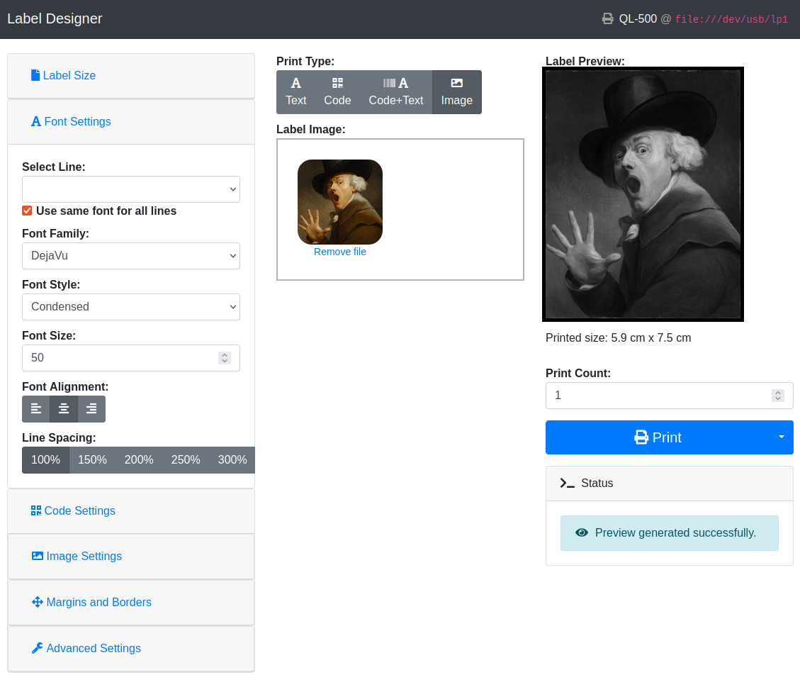
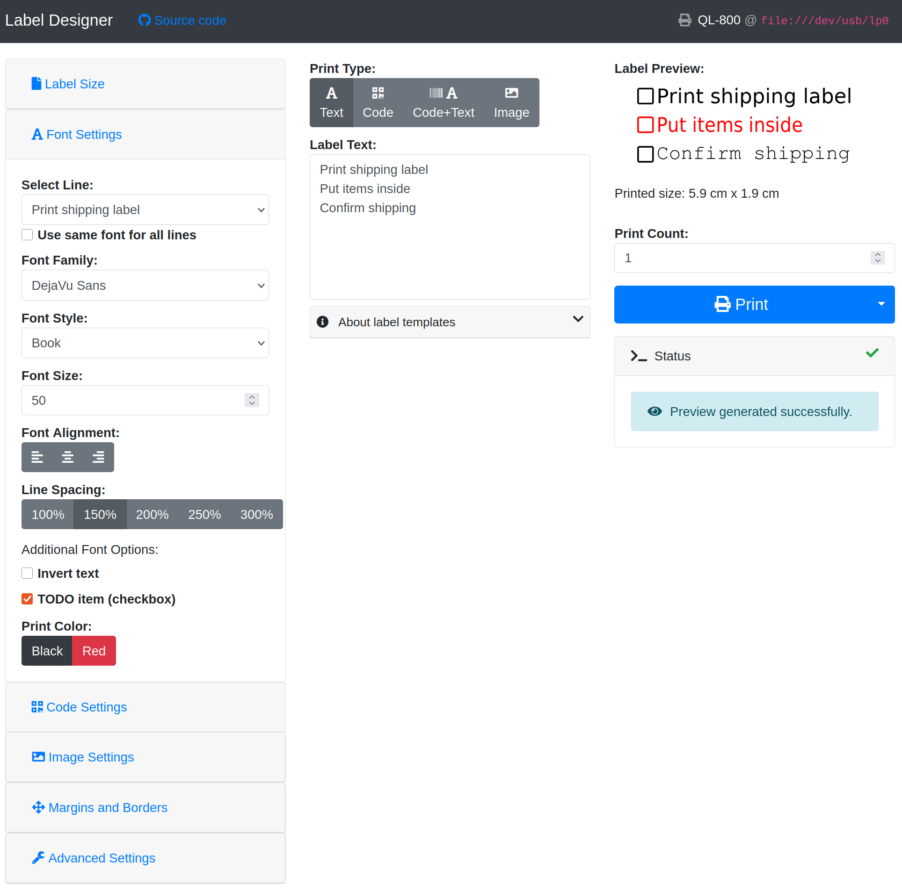

# brother_ql_web

This is a dockerized `python3` web service to print labels on Brother QL label printers.
The web interface is [responsive](https://en.wikipedia.org/wiki/Responsive_web_design).

There are a lot of forks of the `brother_ql` and `brother_ql_web` repos from [pklaus](https://github.com/pklaus/brother_ql).
This fork tries to support many more printers and provide additional features.

Additional printer support comes from [matmair/brother_ql-inventree](https://github.com/matmair/brother_ql-inventree) as a dependency for communicating with the printers and [tbnobody/brother_ql_web](https://github.com/tbnobody/brother_ql_web) as a base for the frontend as there have been a few fixes and improvements implemented over there.This fork also builds on enhancements from [dersimn/brother_ql_web](https://github.com/dersimn/brother_ql_web) for which we are grateful, too.

## Screenshots

### Barcode with text


### QR code with text


### Image with auto-fit



### Supported barcodes


### Automatic printer and label detection


### Native dark mode


### Template support


### TODO list creation



## New Features

- Automatic printer and label detection
- Support for more printers via `brother_ql-inventree` (**new**)
  - QL-500
  - QL-550
  - QL-560
  - QL-570
  - QL-580N
  - **QL-600**
  - QL-650TD
  - QL-700
  - QL-710W
  - QL-720NW
  - QL-800
  - QL-810W
  - QL-820NWB
  - QL-1050
  - QL-1060N
  - **QL-1100**
  - **QL-1110NWB**
  - **QL-1115NWB**
- High-resolution (600dpi) printing support
- Support individual fonts/sizes and spacing for each line of text
- Dynamic content replacement using templates (e.g., `{{datetime}}`, `{{counter}}`)
- Import and export of labels in an easily editable format (JSON)
- Allow text inversion for emphasized text even without color
- Auto-fit images onto the labels to avoid cropping
- Support for TODO list creation (tickable checkboxes)
- Allow text together with images
- Print text as QR Code or barcode
  - Add text to QR Code
  - Change size of QR Code
- Upload files to print
  - PDF, PNG and JPG files
  - automatically convertion to black/white image
- Change print color for black/white/red labels
- Support borders (multi-color, also with rounded edges)
- Print labels multiple times
  - Cut every label
  - Cut only after the last label
- Better error handling
- Native dark mode
- A status icon indicating the current status
  - no color = idle
  - gray = busy
  - green = printing successful
  - red = error needing your attention
- Migrated GUI to Bootstrap 4
- Make preview for round labels... round
- Print images on red/black paper
- Dockerized
- Devcontainer for ease of development/contributing

### Supported templates

- `{{counter[:start]}}` — Inserts the current counter value (automatically increments when printing multiple labels at the same time).
- `{{datetime:format}}` — Inserts the current date and time, e.g. `%H:%M:%S %d.%m.%Y` (see [strftime](https://strftime.org/)).
- `{{uuid}}` — Inserts a random UUID (Universally Unique Identifier).
- `{{short-uuid}}` — Inserts a shortened version of a UUID.
- `{{env:var}}` — Inserts the value of the environment variable `var`.
- `{{random[:len]}}` — Inserts a random string of optional length `len` (defaulting to 64).

## Docker Compose

You may also use the example [`docker-compose.yml`](./docker-compose.yml) file provided in this repository to quickly get started with Docker Compose:

``` yaml
services:
  brother_ql_web:
    image: ghcr.io/dl6er/brother-ql-web:latest
    # build: . # you may also build the container locally
    container_name: brother_ql_web
    restart: always
    ports:
      - "8013:8013"
    devices:
      - "/dev/usb/lp0:/dev/usb/lp0"
    command: >
      --default-label-size 62
      file:///dev/usb/lp0
```

To build the image locally:

```bash
git clone https://github.com/DL6ER/brother_ql_web.git
cd brother_ql_web
docker compose build
```

### Usage

Once it's running, access the web interface by opening the page with your browser.
If you run it on your local machine, go to <http://localhost:8013>.
You will then be forwarded by default to the interactive web gui located at `/labeldesigner`.

All in all, the web server offers:

-   a web GUI allowing you to print your labels, and
-   an API.

### Contributing / Development

To contribute to this project, follow these steps:

1. Create a [fork in your own namespace](https://github.com/DL6ER/brother_ql_web/fork)

2. Clone the repository:
   ```bash
   git clone https://github.com/<your name goes here>/brother_ql_web.git
   cd brother_ql_web
   ```

2. Make your changes and test them locally, preferably inside the convenient devcontainer.

3. Submit a pull request with a clear description of your changes.

This project offers a **Development Container** for easy local development. You can right away start coding without worrying about the environment setup using the free and open source IDE [VSCode](https://code.visualstudio.com/). Other editors may be able to utilize the provided Dockerfile for a similar setup. Note that the provided devcontainer does not mount any possibly existing local USB printers for compatibility reasons. You may want to edit `.devcontainer/devcontainer.json` to mount such local devices.

### License

This software is published under the terms of the GPLv3, see the LICENSE file in the repository.

Parts of this package are redistributed software products from 3rd parties. They are subject to different licenses:

-   [Bootstrap](https://github.com/twbs/bootstrap), MIT License
-   [Font Awesome](https://github.com/FortAwesome/Font-Awesome), CC BY 4.0 License
-   [jQuery](https://github.com/jquery/jquery), MIT License
